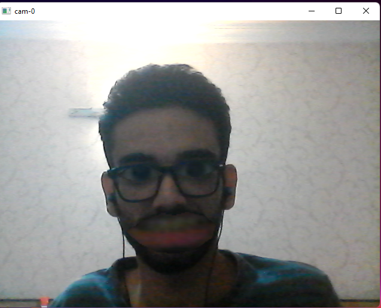
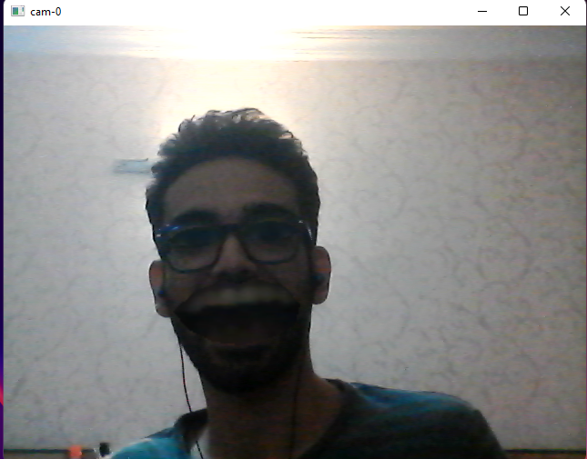

## Lips and Eyes scaling filter
- make target's lips and eyes bigger than real.
- written in **python** using **opencv**, **numpy**, **tensorflow**.
  output :
  > 

## Mouth scaling filter
- Now can scale with your mouth aspect ratio.
- open your mouth to scale it bigger.
- save video frames as *mp4.
  
  output :
  > 
  
    